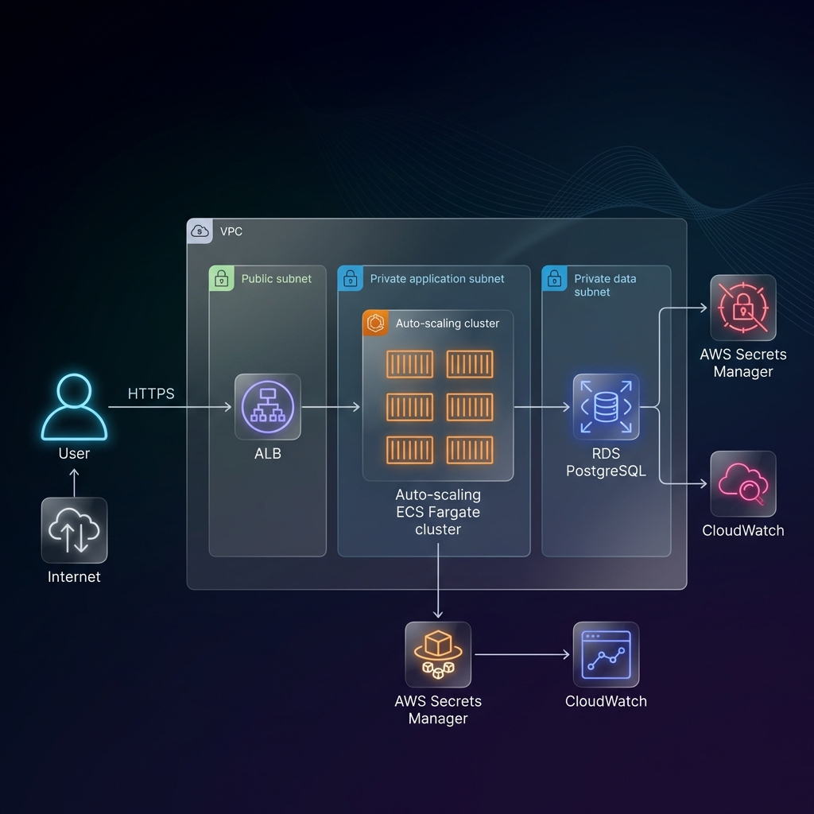
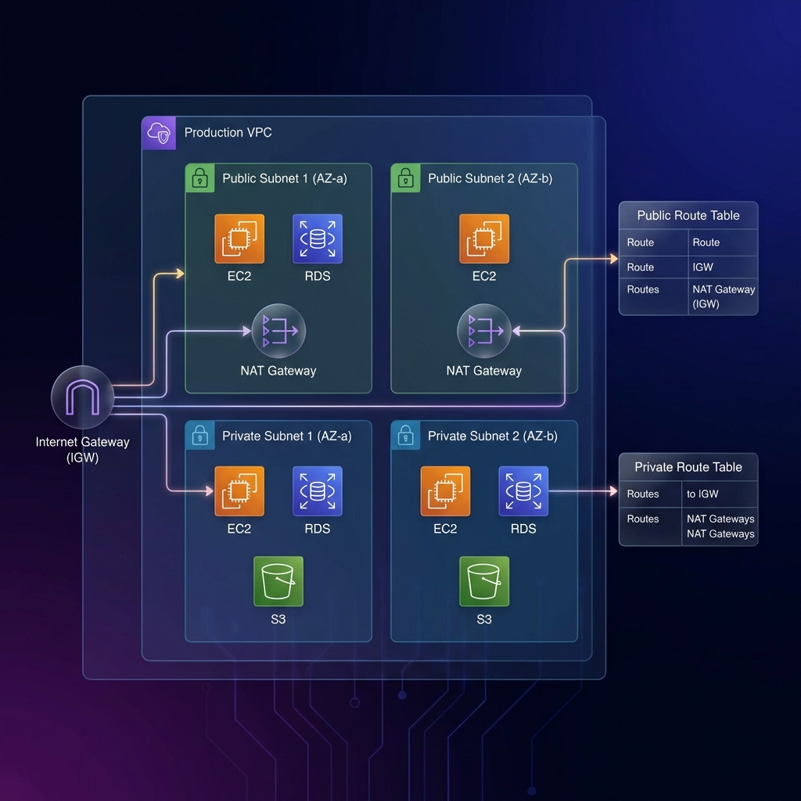
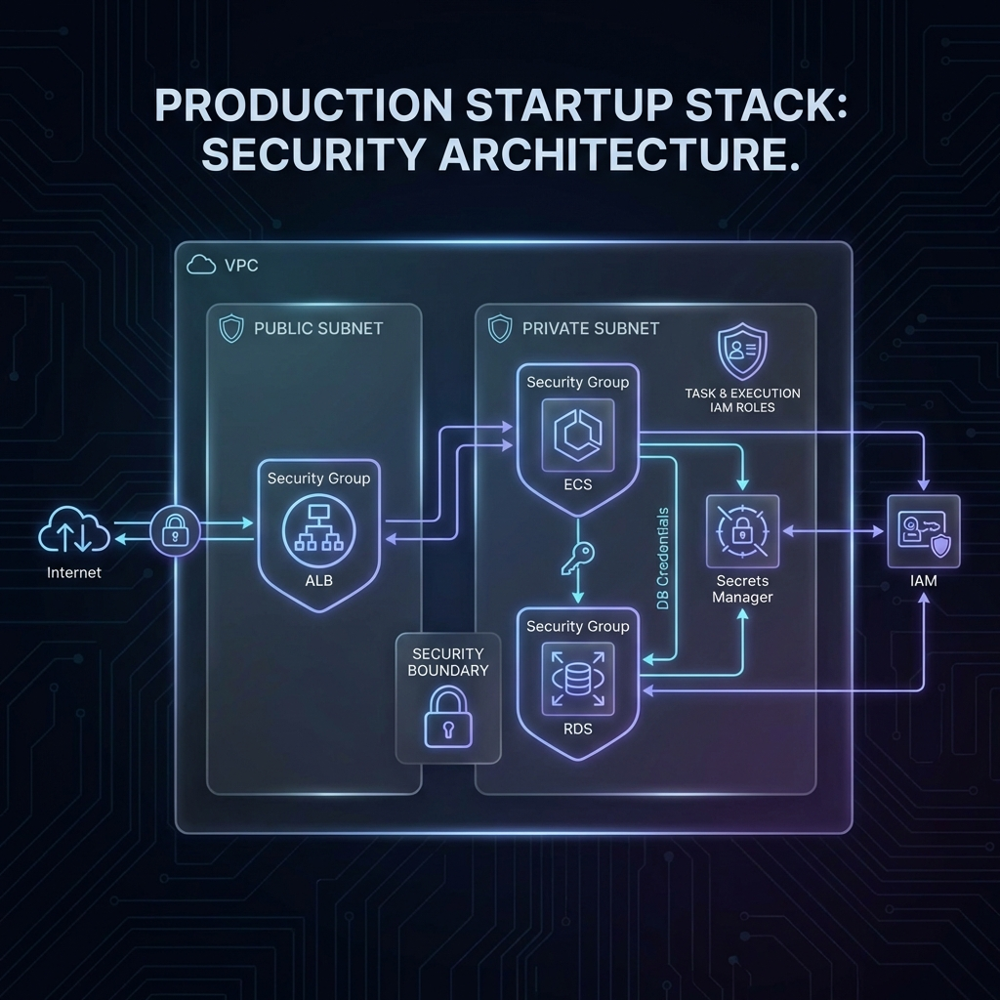

# 🚀 Startup AWS Production Stack

**The smallest AWS infrastructure that is secure, scalable, cost-aware, and truly production-ready.**

## Who This Is For
- **Early-stage startups** looking for a production-ready baseline.
- **Solo founders** needing a secure, low-maintenance stack.
- **Agency engineers** wanting to launch MVPs or POCs (Proof of Concepts) rapidly.

## Tech Stack
- **OpenTofu** (Terraform compatible)
- **AWS ECS Fargate** (Container Orchestration)
- **AWS RDS** (PostgreSQL Database)
- **AWS Secrets Manager** (Password Security)
- **AWS ALB + ACM** (Load Balancing & SSL)
- **AWS VPC** (Public/Private Subnets, NAT Gateway)

## 📊 Architecture

### High-Level Architecture


### Networking Architecture


### Security Boundaries



## 🛠️ Quick Start

### 1. Prerequisites
Before you start, ensure you have:
- **OpenTofu** (`brew install opentofu`) OR **Terraform** installed.
- **AWS CLI** installed and configured (`aws configure`).
- A **Domain Name** (e.g., `myapp.com`) with a **Route53 Hosted Zone** in your AWS account.

### 2. Configuration
Create a file named `terraform.tfvars` in `environments/dev/` to store your specific settings. This keeps your changes separate from the code.

**`environments/dev/terraform.tfvars`**
```hcl
project_name    = "my-startup"
container_image = "nginx:latest"  # Replace with your Docker image URL (e.g., DockerHub or ECR)
container_port  = 80              # The port your container listens on
domain_name     = "myapp.com"     # Your actual domain
hosted_zone_id  = "Z123456789ABC" # Find this in Route53 Console -> Hosted Zones
```

> **Tip:** You can find your `hosted_zone_id` by running:
> `aws route53 list-hosted-zones --query "HostedZones[*].{Name:Name,ID:Id}"`

### 3. Deploy
Run the following commands in the `environments/dev` folder:

```bash
# Initialize the project (downloads providers)
tofu init 

# Preview the changes
tofu plan

# Apply the changes (type 'yes' when prompted)
tofu apply
```

> ⏳ **Note:** The apply step may pause for a few minutes while AWS validates your SSL certificate. This is normal.

### 4. Access Your App
Once finished, `tofu` will output your Load Balancer DNS (though you should just visit your domain):
- Go to `https://myapp.com`

---

## Architecture Overview
- **Security**: 
    - Application and Database live in **Private Subnets** (no direct internet access).
    - **NAT Gateway** allows them to download updates/images securely.
    - **ALB** handles HTTPS termination and forwards traffic to the app.
- **Database**:
    - Password is auto-generated and stored in **AWS Secrets Manager**.
    - App reads the password securely at runtime via environment variables.

## 🧹 Clean Up
To avoid incurring costs (~$50/mo for NAT GW + RDS) when you are done testing:

```bash
tofu destroy
```

## Estimated Monthly Cost
See [cost/monthly-estimate.md](cost/monthly-estimate.md)

## License
MIT